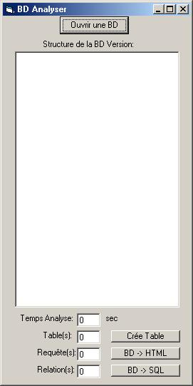



## BD Analyser

### Description

This program, show many statistic about your Data Base And it convert your data base to HTML and SQL format.

Please, Vote for my source code...
 
### More Info
 

             |
---                |---
**Submitted On**   |2001-04-16 23:00:00
**By**             |[N/A](https://github.com/Planet-Source-Code/PSCIndex/blob/master/ByAuthor/empty.md)
**Level**          |Advanced
**User Rating**    |4.3 (17 globes from 4 users)
**Compatibility**  |VB 5\.0, VB 6\.0
**Category**       |[Databases/ Data Access/ DAO/ ADO](https://github.com/Planet-Source-Code/PSCIndex/blob/master/ByCategory/databases-data-access-dao-ado__1-6.md)
**World**          |[Visual Basic](https://github.com/Planet-Source-Code/PSCIndex/blob/master/ByWorld/visual-basic.md)
**Archive File**   |[BD Analyse184684162001\.zip](https://github.com/Planet-Source-Code/bd-analyser__1-22470/archive/master.zip)

